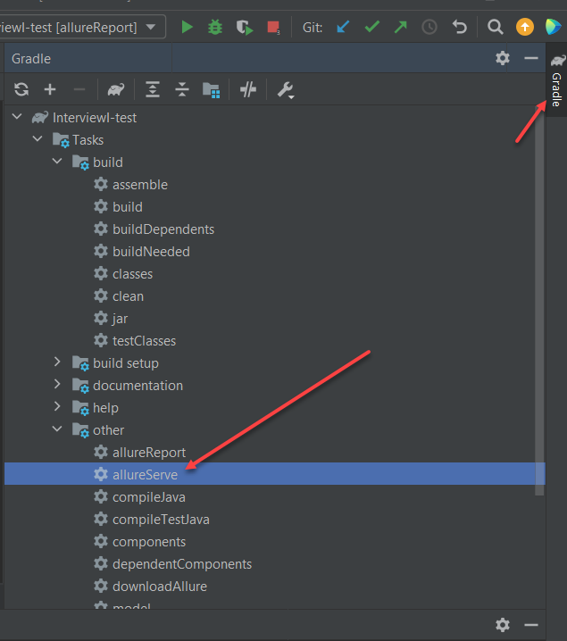

# InterviewI-test
Тесты можно запустить из Терминала при помощи команды "gradlew test" или кликнув правой кнопкой мыши на Run выбрав Java файл в котором содержаться тесты.

После того как пройдут тесты, для запуска отчета allure report написать в Терминале команду "gradlew allureServe"
Или воспользоваться внутренним плагином 